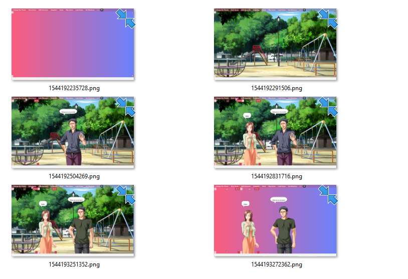
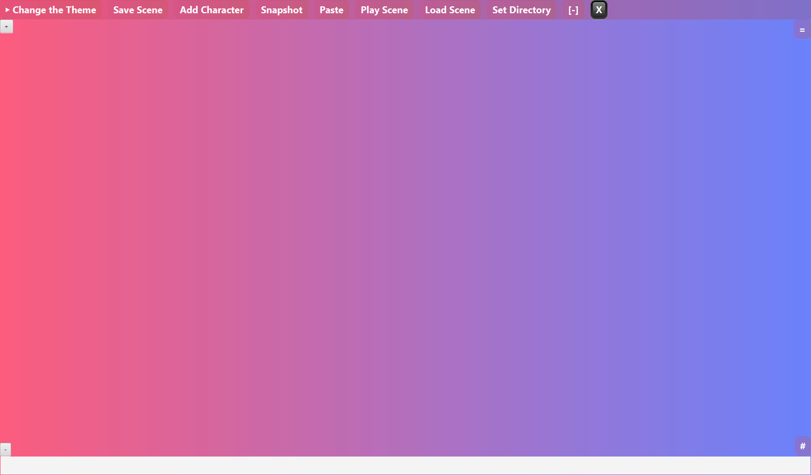
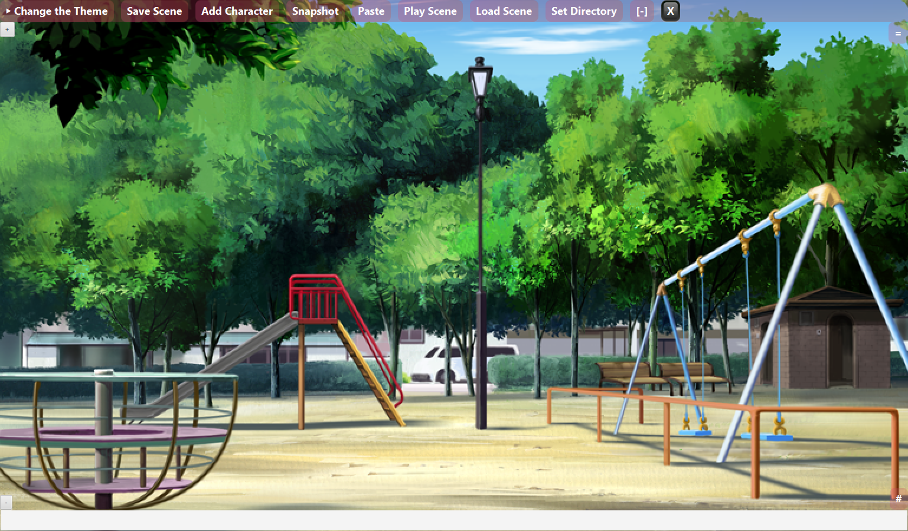
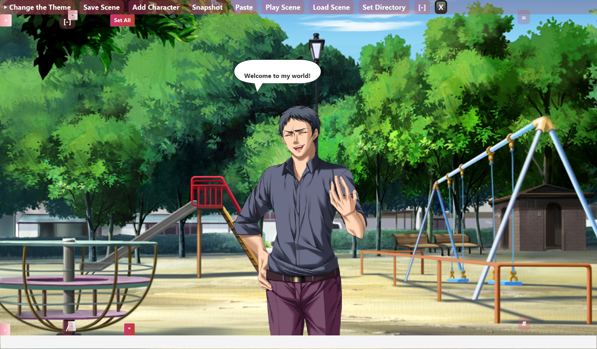
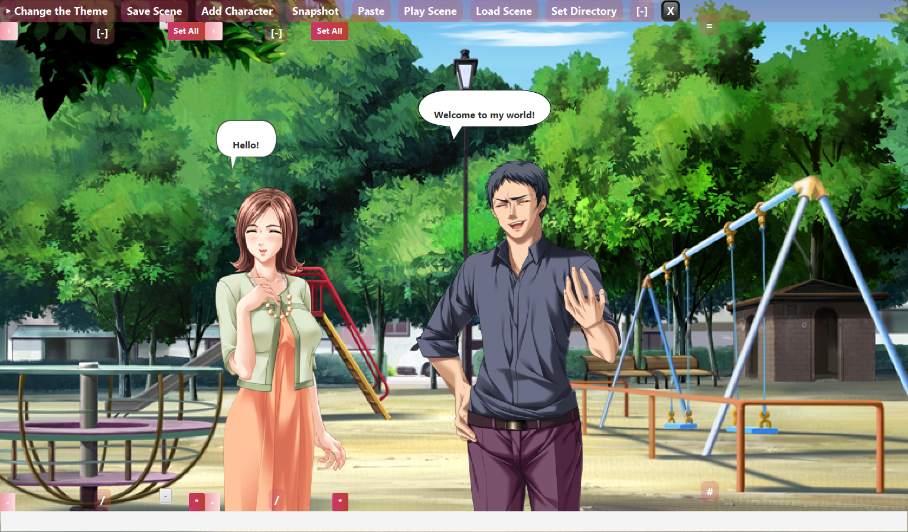
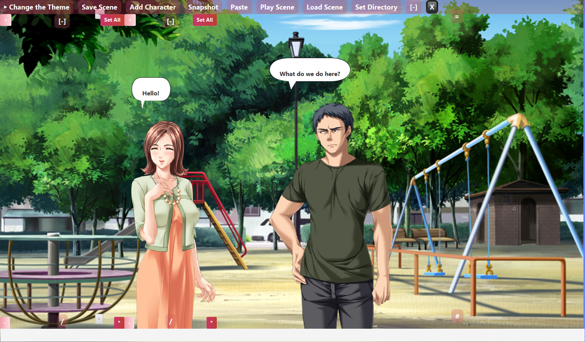
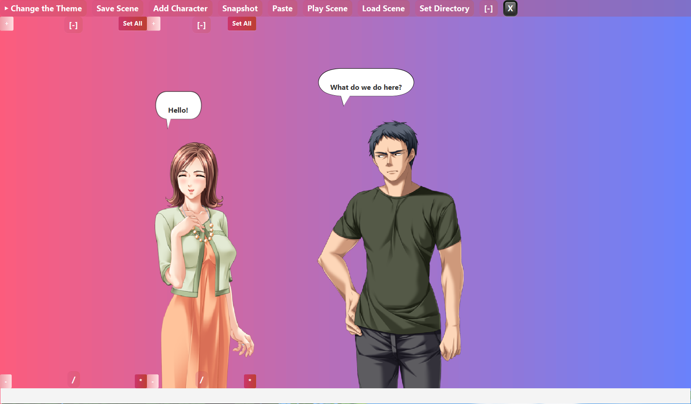

# JFXMPI
JavaFx Desktop App for Visual Content &amp; Story Creation

Executable: https://github.com/Azmechatech/JFXMPI/blob/master/lib/JFXMPI-1.0-SNAPSHOT-jar-with-dependencies.jar

I will add more documentation once I have time.

To run the app just execute the jar file after clean build.

Some screenshots below for the Desktop App.

The characters are picked from game CG/Sprites. You can find them on various websites. 

# Sample Backrgound Images 
https://github.com/Azmechatech/NONHUMAN.git

# Sample Women Images
https://github.com/Azmechatech/WOMEN.git

# Sample Men Images
https://github.com/Azmechatech/MEN.git

